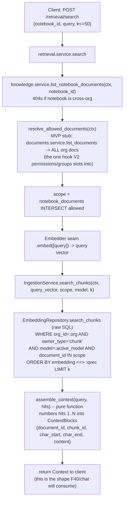
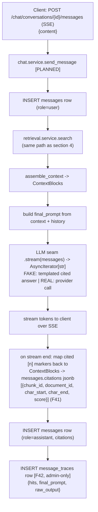
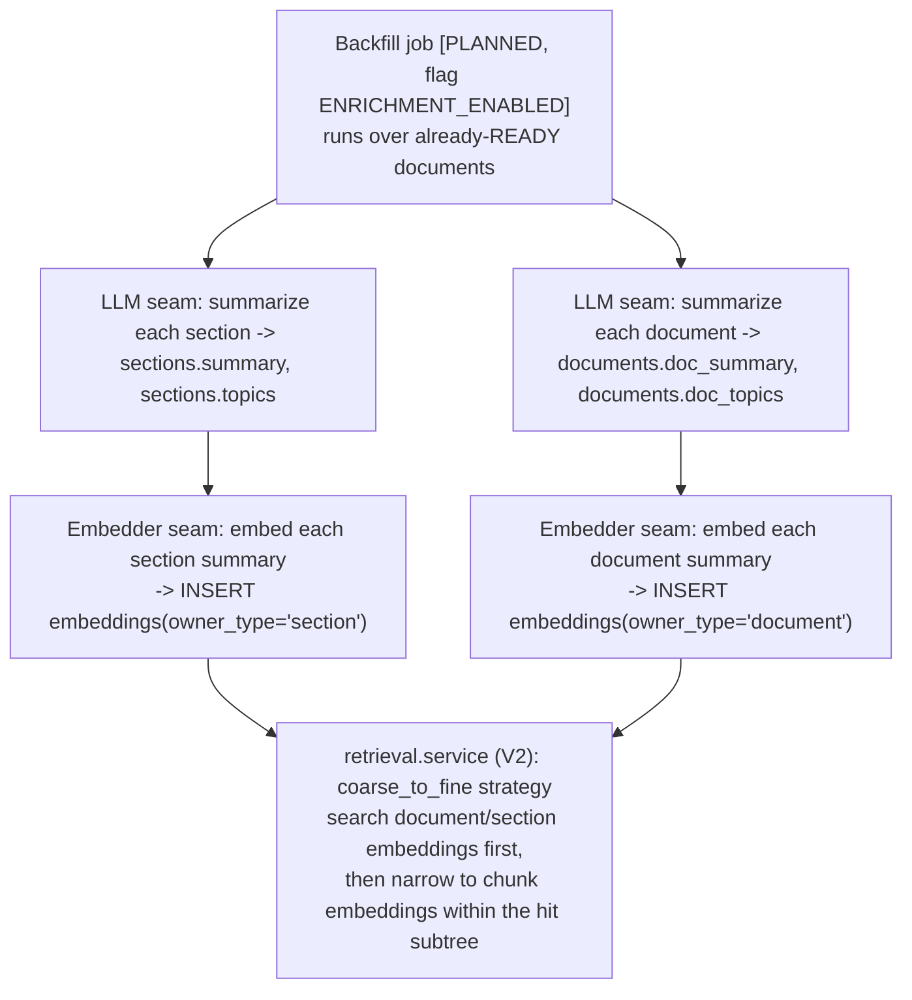
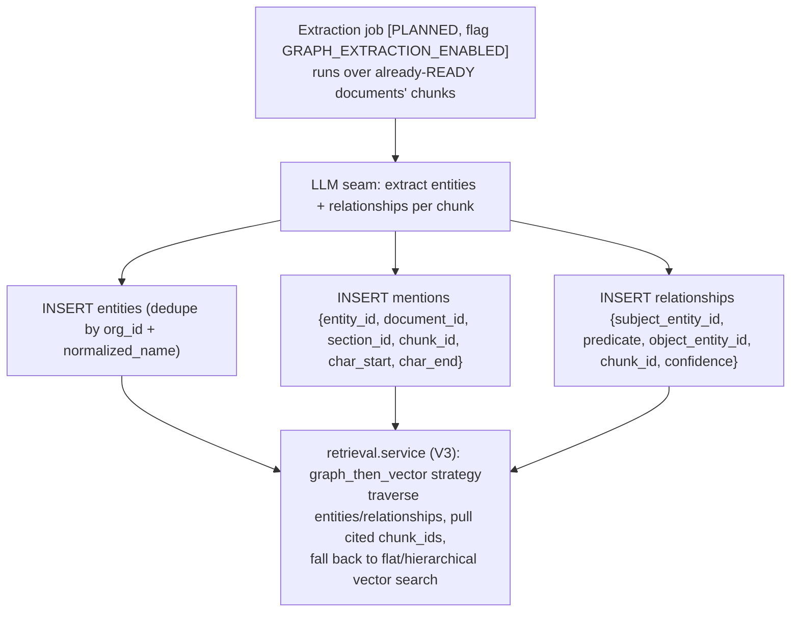

# Keystone — Entity-Relationship Diagram & Data Flow

This document is a **read-only reference**, generated by reading the actual ORM models
(`backend/app/*/models.py`, `documents/status.py`) plus the design contract in
`.claude/context/architecture.md`. It does not change any code or schema.

It covers two layers, clearly tagged on every field:

- **`[BUILT]`** — table/column exists today, backed by a real migration, exercised by tests
  (Phase 0–3, F00–F31, as of commit `63a800a`).
- **`[PLANNED]`** — table/column is part of the locked design in `architecture.md` but has
  no migration yet (Phase 4 chat, V2 enrichment, V3 knowledge graph). Sub-tagged:
  - `[PLANNED — F40/F41/F42]` next up, Phase 4 (chat).
  - `[PLANNED — V2]` hierarchical retrieval / enrichment backfill, additive, no new tables.
  - `[PLANNED — V3]` knowledge graph, additive, new tables created only in V3.

---

## 1. Full ER diagram (built + planned, one diagram)

```mermaid
erDiagram
    ORGANIZATIONS {
        uuid id PK
        text name
        text plan
        timestamptz created_at
    }

    USERS {
        uuid id PK
        uuid org_id FK
        citext email
        text role "owner | admin | member"
        text password_hash "nullable"
        timestamptz created_at
    }

    FOLDERS {
        uuid id PK
        uuid org_id FK
        uuid parent_id FK "nullable, self-ref"
        text name
        text path "materialized e.g. 'HR/Policies'"
        timestamptz created_at
    }

    TAGS {
        uuid id PK
        uuid org_id FK
        text name
    }

    DOCUMENT_TAGS {
        uuid org_id FK
        uuid document_id PK_FK
        uuid tag_id PK_FK
    }

    DOCUMENTS {
        uuid id PK
        uuid org_id FK
        uuid folder_id FK "nullable, not a permission boundary"
        text title
        text source_type "PLANNED upload|gdrive|url, today implicit=upload"
        text storage_key "nullable"
        text mime_type "nullable"
        bigint byte_size "nullable"
        text checksum "nullable, unique(org_id,checksum)"
        int page_count "nullable, set at parse"
        text language "nullable, set at parse"
        text status "UPLOADED|PARSING|STRUCTURING|EMBEDDING|READY|FAILED"
        text failed_stage "nullable"
        text error_detail "nullable"
        text doc_summary "PLANNED V2 enrichment"
        jsonb doc_topics "PLANNED V2 enrichment"
        jsonb metadata "default {}"
        uuid created_by "PLANNED, not yet on the model"
        timestamptz created_at
        timestamptz updated_at "PLANNED, not yet on the model"
    }

    SECTIONS {
        uuid id PK
        uuid org_id FK
        uuid document_id FK "cascade delete"
        uuid parent_section_id FK "nullable, self-ref, cascade delete"
        int ordinal "sibling order"
        int depth "heading level / tree depth"
        text path "e.g. '1.2.3'"
        text heading "nullable"
        int page_start
        int page_end
        int char_start
        int char_end
        text summary "PLANNED V2 enrichment, nullable"
        jsonb topics "PLANNED V2 enrichment, nullable"
        timestamptz created_at
    }

    CHUNKS {
        uuid id PK "deterministic hash(doc_id,ordinal,content)"
        uuid org_id FK
        uuid document_id FK "cascade delete"
        uuid section_id FK "nullable, cascade delete"
        int ordinal "document-wide order"
        text content
        int token_count
        int char_start
        int char_end
        jsonb metadata "default {}, e.g. heading breadcrumb"
        timestamptz created_at
    }

    EMBEDDINGS {
        uuid id PK
        uuid org_id FK
        uuid document_id FK "denormalized, cascade delete"
        text owner_type "now: chunk | PLANNED V2: section, document"
        uuid owner_id "polymorphic FK -> chunks.id | sections.id | documents.id"
        text model "provenance: which embedding model"
        int dim
        vector_1536 embedding "HNSW index"
        timestamptz created_at
    }

    KNOWLEDGE_BASES {
        uuid id PK "public name: Notebook"
        uuid org_id FK
        text name
        text description "nullable"
        uuid created_by FK "nullable, users.id, SET NULL"
        timestamptz created_at
        timestamptz updated_at
    }

    KNOWLEDGE_BASE_DOCUMENTS {
        uuid org_id FK
        uuid knowledge_base_id PK_FK
        uuid document_id PK_FK "cascade delete"
        timestamptz added_at
    }

    CONVERSATIONS {
        uuid id PK "PLANNED F40"
        uuid org_id FK
        uuid knowledge_base_id FK
        uuid user_id FK
        timestamptz created_at
    }

    MESSAGES {
        uuid id PK "PLANNED F40/F41"
        uuid org_id FK "on the child table too, no scope-via-parent"
        uuid conversation_id FK "cascade delete"
        text role
        text content
        jsonb citations "[{chunk_id, document_id, char_start, char_end, score}], F41"
        timestamptz created_at
    }

    MESSAGE_TRACES {
        uuid id PK "PLANNED F42, admin debug bundle"
        uuid org_id FK "admin-read-only, role in owner/admin"
        uuid message_id FK "cascade delete"
        jsonb hits "retrieved chunks + scores"
        text final_prompt "exact assembled prompt"
        text raw_output "model's raw response"
        timestamptz created_at
    }

    ENTITIES {
        uuid id PK "PLANNED V3, no migration yet"
        uuid org_id FK
        text name
        text normalized_name
        text type
        jsonb metadata
    }

    MENTIONS {
        uuid id PK "PLANNED V3"
        uuid org_id FK
        uuid entity_id FK
        uuid document_id FK
        uuid section_id FK "nullable"
        uuid chunk_id FK
        int char_start
        int char_end
    }

    RELATIONSHIPS {
        uuid id PK "PLANNED V3"
        uuid org_id FK
        uuid subject_entity_id FK
        text predicate
        uuid object_entity_id FK
        uuid chunk_id FK
        real confidence
    }

    %% ---- relationships ----
    ORGANIZATIONS ||--o{ USERS : "has"
    ORGANIZATIONS ||--o{ FOLDERS : "scopes"
    ORGANIZATIONS ||--o{ TAGS : "scopes"
    ORGANIZATIONS ||--o{ DOCUMENTS : "scopes"
    ORGANIZATIONS ||--o{ SECTIONS : "scopes"
    ORGANIZATIONS ||--o{ CHUNKS : "scopes"
    ORGANIZATIONS ||--o{ EMBEDDINGS : "scopes"
    ORGANIZATIONS ||--o{ KNOWLEDGE_BASES : "scopes"
    ORGANIZATIONS ||--o{ CONVERSATIONS : "scopes (planned)"
    ORGANIZATIONS ||--o{ MESSAGES : "scopes (planned)"
    ORGANIZATIONS ||--o{ MESSAGE_TRACES : "scopes (planned)"
    ORGANIZATIONS ||--o{ ENTITIES : "scopes (planned V3)"

    FOLDERS ||--o{ FOLDERS : "parent_id (tree)"
    FOLDERS ||--o{ DOCUMENTS : "folder_id (home folder, not a boundary)"

    TAGS ||--o{ DOCUMENT_TAGS : "tagged via"
    DOCUMENTS ||--o{ DOCUMENT_TAGS : "tagged via"

    DOCUMENTS ||--o{ SECTIONS : "parsed into (cascade delete)"
    SECTIONS ||--o{ SECTIONS : "parent_section_id (tree)"
    SECTIONS ||--o{ CHUNKS : "chunked from leaf sections"
    DOCUMENTS ||--o{ CHUNKS : "owns (cascade delete)"
    DOCUMENTS ||--o{ EMBEDDINGS : "denormalized owner (cascade delete)"
    CHUNKS ||--o| EMBEDDINGS : "owner_type=chunk (now)"
    SECTIONS ||--o| EMBEDDINGS : "owner_type=section (planned V2)"
    DOCUMENTS ||--o| EMBEDDINGS : "owner_type=document (planned V2)"

    KNOWLEDGE_BASES ||--o{ KNOWLEDGE_BASE_DOCUMENTS : "references"
    DOCUMENTS ||--o{ KNOWLEDGE_BASE_DOCUMENTS : "referenced by (cascade delete)"

    KNOWLEDGE_BASES ||--o{ CONVERSATIONS : "scoped to (planned)"
    USERS ||--o{ CONVERSATIONS : "owns (planned)"
    USERS ||--o{ KNOWLEDGE_BASES : "created_by"
    CONVERSATIONS ||--o{ MESSAGES : "has (planned, cascade delete)"
    MESSAGES ||--o| MESSAGE_TRACES : "has one trace (planned, cascade delete)"

    ENTITIES ||--o{ MENTIONS : "mentioned in (planned V3)"
    DOCUMENTS ||--o{ MENTIONS : "contains (planned V3)"
    SECTIONS ||--o{ MENTIONS : "contains, nullable (planned V3)"
    CHUNKS ||--o{ MENTIONS : "provenance (planned V3)"
    ENTITIES ||--o{ RELATIONSHIPS : "subject (planned V3)"
    ENTITIES ||--o{ RELATIONSHIPS : "object (planned V3)"
    CHUNKS ||--o{ RELATIONSHIPS : "provenance (planned V3)"
```

> Note on `EMBEDDINGS`: it is **one physical table**, polymorphic on `owner_type`. The three
> `||--o|` lines into it (`CHUNKS`/`SECTIONS`/`DOCUMENTS`) are not three FKs — `owner_id` is an
> untyped UUID that means "chunks.id, sections.id, or documents.id" depending on `owner_type`.
> This is deliberate (see architecture.md) so V2 can insert `section`/`document` rows with zero
> migration.

---

## 2. What's actually built today vs. what's still a design contract

| Module | Tables (built) | Status |
|---|---|---|
| `identity` | `organizations`, `users` | **Built** — F00/F01/F10 |
| `documents` | `folders`, `tags`, `document_tags`, `documents` | **Built** — F11/F12 |
| `ingestion` | `sections`, `chunks`, `embeddings` | **Built** — F20/F21/F22, owns no table of its own beyond these (no separate `ingestion` table — `documents.status` drives the pipeline) |
| `knowledge` | `knowledge_bases` (public name: **Notebook**), `knowledge_base_documents` | **Built** — F30 |
| `retrieval` | *(none — reads ingestion's tables via `IngestionService.search_chunks`)* | **Built** — F31, deliberately owns no table |
| `chat` | `conversations`, `messages`, `message_traces` | **Planned, not migrated** — Phase 4 (F40 generation, F41 citations, F42 debug bundle) |
| *(none yet)* | `entities`, `mentions`, `relationships` | **Planned, not migrated** — V3 knowledge graph, created only when V3 starts |

A few specific gaps between the architecture.md design and the actual `Document`/`Notebook`
models worth flagging (none of these are bugs — they're just not built yet):
- `documents.source_type`, `documents.created_by`, `documents.updated_at` are in the
  architecture.md spec but **not yet columns** on the live `Document` ORM model — `source_type`
  defaults implicitly to "upload" (no connector exists yet), `created_by`/`updated_at` haven't
  been needed by any feature so far.
- `documents.doc_summary` / `doc_topics` and `sections.summary` / `sections.topics` **do exist**
  as real nullable columns today (built ahead of need, per the structural-vs-semantic split) —
  they're just always `NULL` until the V2 enrichment backfill job is built and turned on.

---

## 3. Data flow — ingestion (built, F20–F22)

```mermaid
flowchart TD
    A["Client: POST /documents/upload (multipart)"] --> B["documents.service.upload_document"]
    B --> C{"checksum already exists\nfor this org_id?"}
    C -- yes --> D["return existing Document (200)"]
    C -- no --> E["INSERT documents row (status=UPLOADED)\nORG_ID always set"]
    E --> F["ObjectStore.put(blob) -> storage_key\norg/{org_id}/doc/{document_id}/source{ext}"]
    F --> G["commit, return Document (201)"]

    G --> H["Client: POST /ingestion/documents/{id}/parse"]
    H --> I["ingestion.service.run_parsing_stage"]
    I --> J["documents_service.begin_parsing\n(eligible only if UPLOADED / PARSING-crashed / FAILED-at-PARSING)"]
    J --> K["ObjectStore.get(storage_key)"]
    K --> L["Parser seam .extract(blob, mime)\nFAKE (deterministic) or REAL (OpenRouter cloudflare-ai -> mistral-ocr fallback)"]
    L --> M["persist artifact JSON to object store\n.../artifacts/parsing.json\n{text, language, page_count, outline[]}"]
    M --> N["documents_service.complete_parsing\n(sets language, page_count, status=STRUCTURING)"]

    N --> O["Client: POST /ingestion/documents/{id}/structure"]
    O --> P["ingestion.service.run_structuring_stage"]
    P --> Q["read parsing.json artifact"]
    Q --> R["build sections tree from outline\n(level-keyed stack; degenerate outline -> 1 root section)"]
    R --> S["chunk LEAF sections only\n(~1000-char windows, whitespace-aligned)"]
    S --> T["delete-then-rebuild sections+chunks\nin one transaction (idempotent)"]
    T --> U["documents_service.complete_structuring\n(status=EMBEDDING)"]

    U --> V["Client: POST /ingestion/documents/{id}/embed"]
    V --> W["ingestion.service.run_embedding_stage"]
    W --> X["ChunkRepository.list_for_document"]
    X --> Y["Embedder seam .embed(texts) -- ONE batched call"]
    Y --> Z["EmbeddingRepository.upsert_chunk_embeddings\nON CONFLICT(owner_type,owner_id,model) DO UPDATE"]
    Z --> AA["documents_service.complete_embedding\n(status=READY)"]

    I -. any exception .-> FAIL["documents_service.fail_stage\nstatus=FAILED, failed_stage=<stage>, error_detail=<msg>"]
    P -. any exception .-> FAIL
    W -. any exception .-> FAIL
```

Every stage is **idempotent and resumable**: re-calling `/parse`, `/structure`, or `/embed` on a
document already past that stage is a no-op; calling it again after a crash mid-stage repeats
only that stage (parsing even reuses the already-persisted artifact instead of re-paying OCR
cost). No stage holds a DB transaction open across an external seam call.

---

## 4. Data flow — retrieval (built, F31)

Notes baked into this path:
- The kNN SQL lives in `ingestion/repository.py` (owns `chunks`/`embeddings`), **not** in
  `retrieval/` — `retrieval.service` never imports `ingestion.models`, only calls
  `IngestionService.search_chunks` (module-boundary rule: cross-module access only through a
  service method).
- `model = :active_model` in the `WHERE` clause is what prevents a re-embed (new model name)
  from producing duplicate hits for the same chunk.
- `k` is passed straight to `LIMIT` — **no hidden over-fetch-then-slice**; if a reranker is ever
  added (V2), it must be a named, explicit fetch-then-rerank stage.
- `org_id` is enforced twice on this path: once implicitly (notebook lookup 404s cross-org before
  `search_chunks` is ever called) and once explicitly inside `search_chunks` itself (an
  independent backstop, covered by its own isolation test).

---

## 5. Data flow — planned chat path (F40/F41/F42, not built)

This entire diagram is `[PLANNED]` — no `chat` module code exists yet (the package is reserved
but empty). It is included because the user asked for the full intended dataflow, not just what's
shipped.

---

## 6. Data flow — planned V2 enrichment backfill (hierarchical retrieval)

Zero schema migration needed for this — `sections.summary/topics`, `documents.doc_summary/
doc_topics`, and `embeddings.owner_type` already exist as columns/values today; V2 only changes
what populates them and which retrieval strategy is selected behind the flag.

## 7. Data flow — planned V3 knowledge graph extraction

`entities`/`mentions`/`relationships` are **not migrated yet** — this entire section is design
only, possible without a re-parse because `mentions`/`relationships` point back to `chunk_id` +
`char_start`/`char_end`, provenance already captured by the F21 structuring stage.

---

## 8. Tenancy cross-cutting note

Every table above — built and planned — carries `org_id`, including join/child tables
(`document_tags`, `knowledge_base_documents`, the planned `messages`/`message_traces`). There is
no "scope via parent join" anywhere in the design. App-level `WHERE org_id = :org` is always
applied by the base repository regardless of the `RLS_ENABLED` flag; Postgres Row-Level Security
itself (policies + `app_user`/`migrator` role split + `FORCE RLS`) is written but inert, switched
on only in Phase 6 (F60), before real customer data.
